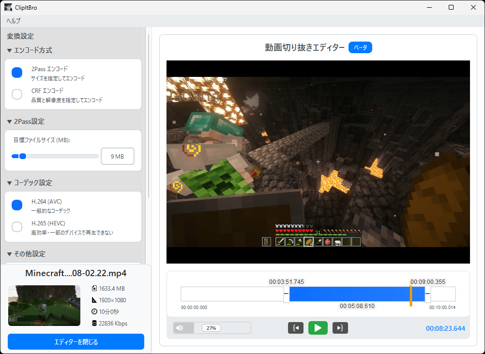

<p align="center">
   
</p>

ClipItBro - powered by 菊池組
====================================

## 概要
ClipItBroは、**動画ファイルをソーシャル向けのサイズに圧縮する**ことを目的として開発されたPyQt5ベースのGUIアプリケーションです。<br />
**リプレイ動画からクリップ部分を切り抜き、SNSにアップロードできるファイルサイズまで圧縮する流れをこのアプリひとつでめちゃくちゃ簡単にできるってワケ‼️**

<br />
### ユースケース
ゲーマーのコミュニティでは、クリップビデオの共有が文化の一つとして根付いています。
しかし、DiscordやWhatsAppなどのソーシャルアプリにおいては、ユーザーがアップロードできる動画ファイルサイズが制限されており、クリップビデオの投稿が困難な場合があります（例えば、Discordの無料プランは最大10MBです）。<br />
ClipItBroはそうしたケースにおいて、クリップビデオの作成とファイルサイズの縮小を簡単に行うソリューションを提供します‼️

### 変換モード
- **2passモード**: 目標ファイルサイズを指定するモード
- **CRFモード**: 目標品質を指定するモード

<br />
## 使用方法
### 基本操作
0. **FFmpegの準備**: `ClipItBro.exe`と同じフォルダに`bin`フォルダを作成し、その中に`ffmpeg.exe`と`ffprobe.exe`を置いてください
1. **ClipItBro.exeを起動**: アプリケーションをダブルクリック、もしくは動画ファイルを右クリックして「プログラムから開く」から起動できます
2. **ファイル読み込み**: 変換したい動画ファイルをテキストエリアにドラッグ&ドロップします
3. **変換モード選択とパラメーター設定**: 
   - **2pass**: ファイルサイズスライダーで目標サイズを設定
   - **CRF**: CRF&vfスライダーで品質レベルを設定
4. **(切り抜き)**: 左下のメニューから、動画のクリップ部分を選んで切り抜くことができます
5. **変換実行**: 「変換実行」ボタンを押して終わるまで待ちます
6. **メカクシ完了**

### 高度な操作
- **テーマ切り替え**: メニューバー「表示」→「テーマ」から選択
- **変換方式切り替え**: 2pass/CRFボタンでワンクリック切り替え

### CRFモード
2passモードは出力ファイルサイズを指定して自動で変換を行いますが、元ファイルが大きかったり長かったりすると見るに堪えない画質になってしまうことがあります。その場合にCRFモードを試してみてください。<br />
変換時に使う**CRF（Constant Rate Factor）** と **VF（Video Filter）** パラメータの値を自分で決めて変換を実行することができます。

#### CRFの設定
デフォルト値は23 値が小さいほど高画質高ファイルサイズ<br />
黄金とされている値は28 **まずは28**で試してみてください<br />
値が6違うとファイルサイズが倍変わってくると言われているらしいが本当か？

#### VFの設定
VFは解像度のスケーリング デフォルトは`1` <br />
1920x1080の動画を`0.8`で変換すると出力ファイルの解像度は`*0.8`して 1536x864になるってワケ。<br />
フルHDの解像度でガビガビの画質よりも解像度を下げたほうがまだ見やすいっていうケースが結構あるから、2passモードで試してみて結果がゴミだったときはCRFモードに切り替えてCRFとVFを下げるのを試せ！

<br />
## 出力ファイル名
入力ファイルと同じディレクトリに出力されます
```
ClipItBro_YYYY_MM_DD_HH_MM_SS_[変換方式]_[元ファイル名].mp4
```

例：
- ClipItBro_2025_08_27_20_15_30_2pass_samplevideo.mp4
- ClipItBro_2025_08_27_20_15_30_CRF_samplevideo.mp4

<br />
## ライセンス
ClipItBro本体は **MIT License** の下で提供されています。詳細は `LICENSE` ファイルをご確認ください。

### 依存関係のライセンス
- **PyQt5**: GPL v3 または Commercial License
- **FFmpeg**: LGPL v2.1+ (一部コーデックはGPL v2+)
- **Python**: Python Software Foundation License

### FFmpegについて
- FFmpegのバイナリはリポジトリに含まれていません。ユーザーが別途ダウンロードして実行ファイルと同じフォルダの `bin\` フォルダに配置する必要があります

---

<p align="center">© 2025 KIKUCHIGUMI. All Rights Reserved.</p>
